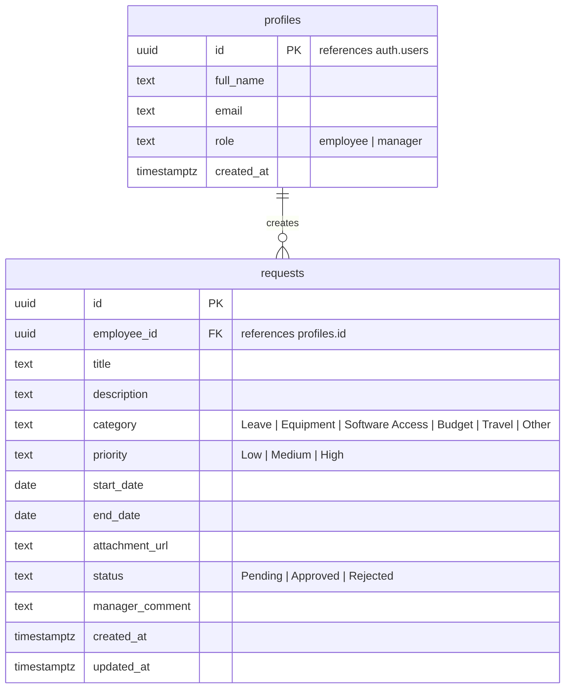

# VibeFlow - Employee Request Approval System

VibeFlow is a production-ready **Employee Request Approval System** built using Next.js 15 (App Router), TypeScript, Tailwind CSS, and Supabase. It implements standard role-based access controls, interactive dashboards for employees and managers, optional document attachments, Row Level Security (RLS) policies, and real-time interface syncs.

---

## 🚀 Key Features

### 👤 Employee Dashboard
* **Create Requests**: Submit leaves, travel, budgets, software access, and equipment upgrades.
* **Supporting Attachments**: Upload documents (PDF, Doc, Images) directly into Supabase Storage.
* **Pending Actions**: Edit or permanently delete pending requests prior to manager review.
* **Audit Tracking Timeline**: Visually inspect creation dates, manager comment notes, and approval timestamps.
* **Instant Filters**: Search title contents and filter by Category, Priority, and status logs.

### 💼 Manager Dashboard
* **Analytics Metrics**: Statistics overview tracking total requests, pending, approved, and rejected volumes.
* **Tabular Queue**: Clean tabular view of all organization records displaying employee names.
* **Decision Modal**: Instant approval/rejection selectors requiring manager justification comments.
* **CSV Export Reports**: Generate structured, escaped CSV files from the currently filtered dataset.
* **Interactive Sorting**: Clickable column headers (Employee Name, Category, Title, Priority, Date, Status) for rapid sorting.

### 🔐 System Security & Real-Time Sync
* **Supabase Auth**: Complete email/password authentication flows.
* **Row Level Security (RLS)**: Database-enforced policies ensuring employees can only access their own request records.
* **Real-time PostgreSQL Subscriptions**: Uses Supabase channel subscriptions to dynamically update listing views the moment a manager reviews a request or an employee updates a record.

---

## 🛠️ Tech Stack

* **Core Framework**: [Next.js 15](https://nextjs.org/) (App Router, Server Actions, Server Components)
* **Programming Language**: [TypeScript](https://www.typescriptlang.org/)
* **CSS Styling**: [Tailwind CSS v4](https://tailwindcss.com/)
* **Database & Authentication**: [Supabase](https://supabase.com/) (PostgreSQL, Auth, Storage, Real-time)
* **Form Validation**: [Zod](https://zod.dev/) & [React Hook Form](https://react-hook-form.com/)
* **PDF Compilation**: [PDFKit](http://pdfkit.org/)

---

## 📂 Folder Structure

```text
employee-approval-system/
├── scripts/
│   └── generate-pdf.js      # Script compiling the presentation PDF
├── supabase/
│   └── migrations/
│       └── schema.sql       # Database schema initialization script
├── src/
│   ├── app/
│   │   ├── actions/
│   │   │   ├── auth.ts      # Server Actions (Login, Signup, Logout)
│   │   │   └── requests.ts  # Server Actions (Request create/edit/delete/review)
│   │   ├── api/
│   │   │   └── seed/        # API endpoint to seed the mock database
│   │   ├── dashboard/       # Dashboard route folder (Sub-routes: employee, manager, profile)
│   │   ├── login/           # SignIn view
│   │   ├── register/        # SignUp view
│   │   ├── globals.css      # Core styles & custom scrollbars
│   │   ├── layout.tsx       # Root layout font setups
│   │   └── page.tsx         # Public Landing Page with Quick Logins
│   ├── components/
│   │   ├── ui/
│   │   │   ├── badge.tsx    # Standard status/priority badges
│   │   │   └── toast.tsx    # Custom context-based toast notifications
│   │   ├── dashboard-shell.tsx # Interactive sidebar/navbar layout wrapper
│   │   ├── request-modal.tsx   # Modal for request submissions & editing
│   │   ├── delete-modal.tsx    # Deletion confirmation dialog
│   │   ├── approval-modal.tsx  # Manager approval decisions modal
│   │   └── request-details-modal.tsx # Details & timeline visual dialog
│   ├── lib/
│   │   ├── supabase/
│   │   │   ├── client.ts    # Browser-side client setup
│   │   │   ├── middleware.ts # Session updates & route protection middleware
│   │   │   └── server.ts    # Server component clients
│   │   └── schemas.ts       # Zod schemas (Auth, Requests, Approvals)
│   └── middleware.ts        # Next.js router middleware interceptor
└── presentation.pdf         # Compiled executive PDF presentation
```

---

## 🗄️ Database Schema & RLS Policies

The PostgreSQL database structure consists of two tables under the `public` schema:



### Row Level Security (RLS) Rules:
1. **Profiles**: Read access is available to all authenticated users. Edits are restricted to the account owner (`auth.uid() = id`).
2. **Requests (Select)**: Employees can view their own requests (`employee_id = auth.uid()`). Managers can query all records.
3. **Requests (Insert)**: Authorized only for authenticated users with role `employee`, setting `employee_id = auth.uid()`.
4. **Requests (Update)**: Employees can edit their requests only if the status is `Pending`. Managers can edit any request (to write decision status and reviews comments).
5. **Requests (Delete)**: Employees can delete requests only if the status is `Pending`.

---

## ⚙️ Setup Instructions

### 1. Initialize Supabase Database
1. Create a new project in the [Supabase Console](https://supabase.com/).
2. Navigate to the **SQL Editor** in the left menu.
3. Copy the contents of the migration file: `supabase/migrations/schema.sql` and run it. This creates tables, triggers, and Row Level Security policies.

### 2. Configure Environment Variables
Create a file named `.env.local` in the root of the project and populate it with your Supabase credentials:
```env
NEXT_PUBLIC_SUPABASE_URL=your-supabase-project-url
NEXT_PUBLIC_SUPABASE_ANON_KEY=your-supabase-anon-public-key
SUPABASE_SERVICE_ROLE_KEY=your-supabase-service-role-key
```

*Note: The `SUPABASE_SERVICE_ROLE_KEY` is a private key required on the server side to perform administrative tasks, such as seeding auth accounts without email verification.*

### 3. Run the Development Server
Run the installation and startup commands using the standard Node command wrappers:
```bash
# Install dependencies
cmd /c "npm install"

# Start the dev server
cmd /c "npm run dev"
```
The application will be running locally at `http://localhost:3000`.

### 4. Seed the Database
1. Open `http://localhost:3000` in your browser.
2. Click the **"Seed Mock Database"** button in the setup panel.
3. The API will delete previous mock data, register the main roles, create 5 additional employees, and populate 25 requests across categories and statuses.

---

## 🔑 Demo Credentials

Test the user dashboard portals using:

| Account Type | Email Address | Password | Privileges |
| :--- | :--- | :--- | :--- |
| **Manager** | `manager@test.com` | `Password123` | Statistics cards, full request approvals, CSV export, column sorting |
| **Employee** | `employee@test.com` | `Password123` | Create requests, upload files, edit/delete pending items, timeline logs |

*Tip: You can also use the **"One-Click Quick Login"** buttons on the landing page to bypass typing credentials.*

---

## 🚀 Vercel Deployment Guide

1. Push your repository to GitHub, GitLab, or Bitbucket.
2. Import the project in the [Vercel Dashboard](https://vercel.com/).
3. Add the three Environment Variables under **Project Settings**:
   * `NEXT_PUBLIC_SUPABASE_URL`
   * `NEXT_PUBLIC_SUPABASE_ANON_KEY`
   * `SUPABASE_SERVICE_ROLE_KEY`
4. Click **Deploy**. Vercel will build and host the Next.js 15 application.
5. Once deployed, run the **"Seed Mock Database"** on the production URL to populate the data.

---

## 🔮 Future Improvements

1. **Email Alerts**: Trigger automated emails using Resend/SendGrid when a request is approved or rejected.
2. **Multi-Stage Workflows**: Multi-step approvals routing requests through team leads, HR, and finance departments sequentially.
3. **Advanced Analytics**: Interactive charts showing category distribution and average approval durations.
